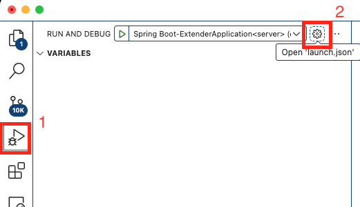

# Extender

Extender is a build server that builds native extensions of the Defold engine. The build server can either by run using Docker or as a stand-alone server running on macOS.

* Server description and setup/run instructions - [link](/server/README.md)
* Debugging FAQ - [link](/README_DEBUGGING.md)

---

## Running as a stand-alone server on macOS
The stand-alone server is currently used on a machine runing macOS. The server is used to build darwin targets (macOS+iOS) using the Apple tools (XCode+Apple Clang). It is also possible to use this setup when developing on macOS.

### Prerequisites
Ensure that you have the following tools packaged:
* iPhoneOS16.2.sdk
* iPhoneOS17.5.sdk
* iPhoneSimulator16.2.sdk
* iPhoneSimulator17.5.sdk
* MacOSX13.1.sdk
* MacOSX14.5.sdk
* XcodeDefault14.2.xctoolchain.darwin
* XcodeDefault15.4.xctoolchain.darwin

NOTE: Complete list of needed packages see [link](./server/scripts/standalone/setup-standalone-env.sh)

Setup all needed packages via
```sh
    DM_PACKAGES_URL=<url_where_package_located> ./server/scripts/standalone/setup-standalone-env.sh
```
It's download packages, unpack it to correct folder and generate .env file with correct pathes

### Local Extender's application
There are two ways to obtain Extender's jars:
1. Download ready-to-use jars from public repo. See instructions [here](https://defold.com/manuals/extender-local-setup/#how-to-run-local-extender-with-preconfigured-artifacts) (step 5).
2. Build jars locally. See instruction [here](./server/README.md#how-to-build-extenders-applications).

As result you should have 2 jars in `./server/apps/` folder: extender.jar and manifestmergetool.jar.

### Run
To run stand-alone Extender instance use folowing script:
```sh
    ./server/scripts/standalone/service-standalone.sh start
```
Script takes commad as 1st argument. Command can be one of the following:
* **start** - start new Extender instance
* **stop** - stop already running Extender instance
* **restart** - stop and start Extender instance from the scratch

If you want to use different Spring profile you can pass it via 2nd argument. For example,
```sh
    ./server/scripts/standalone/service-standalone.sh start standalone-dev
```

Note: all Spring profiles should be located in `./server/configs/` folder.

### Develop/debug standalone Extender using VSCode
Note that [Prerequisites](#prerequisites) should be completed and manifestmergetool.jar already downlaoded or built.

1. Download VSCode: https://code.visualstudio.com/download
2. Install following extensions:
   1. Spring Boot Extension Pack https://marketplace.visualstudio.com/items?itemName=vmware.vscode-boot-dev-pack
   2. Spring Boot Dashboard https://marketplace.visualstudio.com/items?itemName=vscjava.vscode-spring-boot-dashboard
   3. Language Support for Java(TM) by Red Hat https://marketplace.visualstudio.com/items?itemName=redhat.java
   4. Gradle for Java https://marketplace.visualstudio.com/items?itemName=vscjava.vscode-gradle
   5. Debugger for Java https://marketplace.visualstudio.com/items?itemName=vscjava.vscode-java-debug. Note: version should be v0.58.2024090204 (pre-release) or greater.
3. Open folder with Extender sources in VSCode.
4. Go to `Run and Debug` and open `launch.json` 

   

5. Add following launch configuration
    ```json
        {
            "type": "java",
            "name": "Spring Boot-ExtenderApplication<server>",
            "request": "launch",
            "cwd": "${workspaceFolder}",
            "mainClass": "com.defold.extender.ExtenderApplication",
            "projectName": "server",
            "args": "--spring.config.location=classpath:./,file:${workspaceFolder}/server/configs/ --extender.sdk.location=${workspaceFolder}/server/app/sdk --spring.profiles.active=standalone-dev",
            "envFile": ["${workspaceFolder}/server/envs/.env", "${workspaceFolder}/server/envs/user.env", "${workspaceFolder}/server/envs/macos.env"]
        }
    ```
6. Select `Spring Boot-ExtenderApplication<server>` in dropdown and start debug session.
